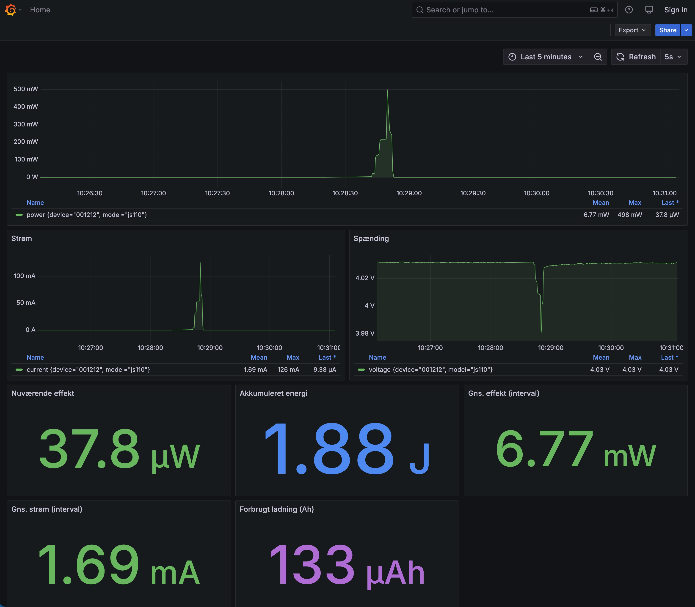

# Joulescope power monitor

Logs power consumption from a Joulescope to a database and visualizes it in a Grafana dashboard.



## Getting started

On a Linux machine (e.g. Ubuntu or a Raspberry Pi):

```bash
git clone <repo> && cd app
make
```

`make` installs Docker if it isn't already present, then builds and starts everything.
Plug the Joulescope into USB and open the dashboard:

**http://localhost:3000** — or from another computer: `http://<machine-ip>:3000`

No login required. There's no configuration — it works plug and play.

## Make commands

| Command | What it does |
|---------|--------------|
| `make` | Install Docker (if needed), build and start everything |
| `make up` | Start the stack / apply changes |
| `make down` | Stop everything |
| `make restart` | Restart the containers |
| `make clean` | Delete all stored measurements |
| `make logs` | Follow the logger output |
| `make ps` | Show container status |

## Notes

- Requires **Linux** (USB access does not work in Docker Desktop on Mac/Windows).
- The Joulescope must be plugged into the machine running the stack.
- Measurements are stored and survive restarts — use `make clean` to reset.
